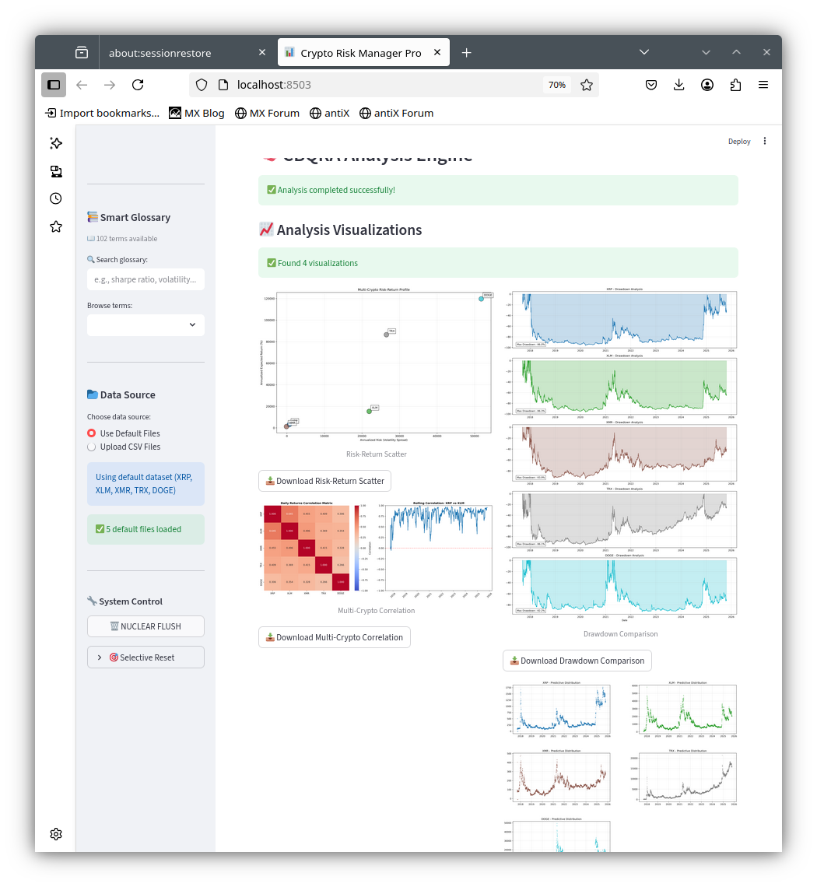
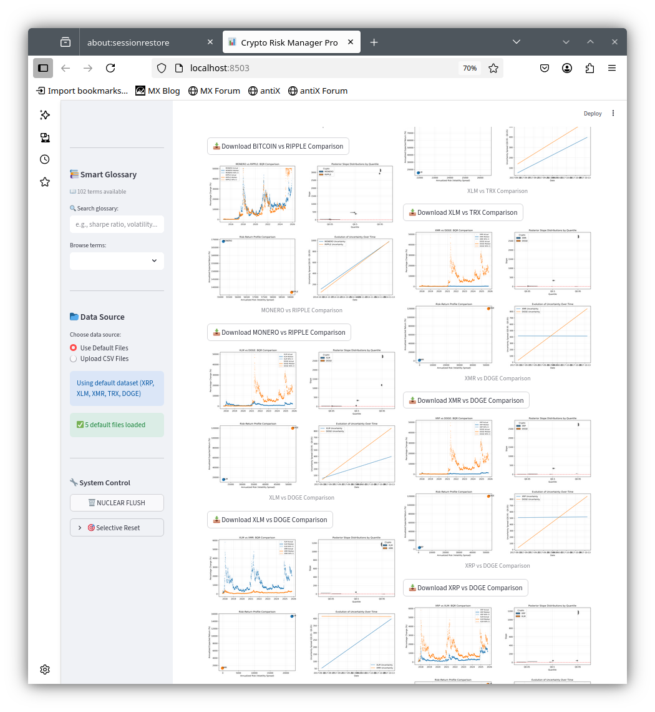

# 🧠 Crypto Risk Manager Pro
Industrial-Strength Quant for the Home Hobbyist



---
## Download the short video "Demo.mp4" (main directory) to view the powerful functionality, vivid visualizations, logical workflow, user-friendly UI and overall superlative UX.
  
## 🚀 Mission Statement

This dashboard democratizes crypto quant analysis. It’s built for:

- **Retail traders**, hobbyist quants, and educators
- **Beginner empowerment** through annotated visuals and glossary tooltips
- **Advanced users** who want to tweak backend parameters (but beware:
  _“Moving away from Prudent Person standards. You have been duly warned.”_)

---

## 🏦 Beyond the 70/30 — Enter Bank III Prudence+

Standard portfolio theory often defaults to a **70/30 equity/bond split**, assuming Gaussian returns and stable regimes. Crypto laughs at that.

**Crypto Risk Manager Pro** embraces:
- **Pessimistic forward drift** modeling
- **Speculative asset caps**
- **Flash crash detection**
- **Kelly Criterion scaling**
- **Volatility-adjusted allocations**
- **Correlation-aware rebalancing**

This isn’t just prudent—it’s **Bank III Prudence+**.

---

## 📊 Standard vs BQR: Why Bayesian Quantile Regression Wins in Crypto

| Feature                     | Standard Regression | Bayesian Quantile Regression (BQR) |
|-----------------------------|---------------------|-------------------------------------|
| Assumes normality           | ✅ Yes              | ❌ No                               |
| Sensitive to outliers       | ✅ Yes              | ❌ No                               |
| Captures tail risk          | ❌ No               | ✅ Yes                              |
| Forecasts full distribution | ❌ No               | ✅ Yes                              |
| Adapts to regime shifts     | ❌ No               | ✅ Yes                              |
| Crypto-ready                | ❌ Not really       | ✅ Absolutely                       |

---

## 🛠️ System Requirements

- **OS:** Any (Windows, Linux, Mac)
- **RAM:** 2GB (yes, really)
- **CPU:** Dual-core Atom or better
- **Storage:** 32GB eMMC or SSD
- **Browser:** Chrome, Firefox, Edge
- **Python:** 3.8+

---

## 🧪 Advanced Mode (Use With Caution)

Want to tweak:
- MCMC sample size?
- Quantile targets?
- Risk thresholds?

Go ahead. But remember:

> _“Moving away from Prudent Person standards. You have been duly warned.”_

---

## 🎉 Features

- 📈 CBQRA with full-screen visuals
- 🧮 Monte Carlo simulations
- 🧠 Smart glossary with fuzzy search
- 🛡️ Risk violation detection
- 🔄 Portfolio backtesting
- 🧼 Nuclear flush for clean resets
- 📂 Upload your own CSVs or use defaults

---

## 🐰 Cultural Notes

This dashboard is powered by:
- 🐇 Bugs Bunny logic (fast, clever, irreverent)
- 🎩 Chaplin charm (silent but expressive)
- 🎸 Kansas-style optimism (carry on, wayward quant)

---

## 🧑‍💻 Getting Started

```bash
pip3 install -r requirements.txt
streamlit run crm_cbqr.py
